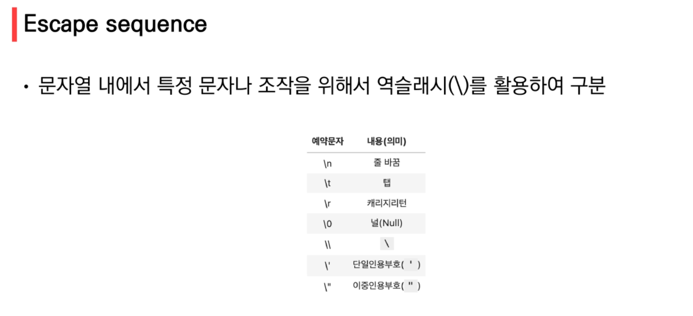
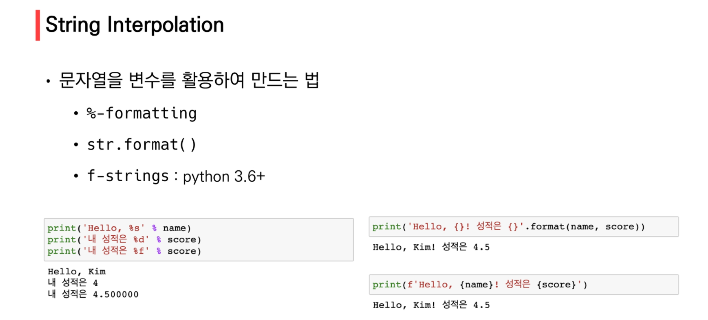
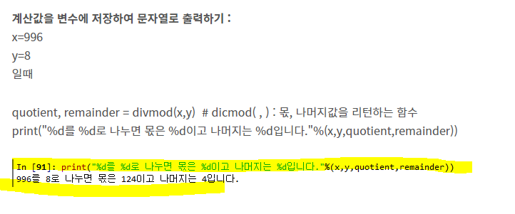

### 2022년 1월 17일





기억이 안나면 +를 사용하자.

```bash
a = 3               # interger
b = '3'             # string

print(a)
print(b)

print(type(a), type(b))
3
3
```




## 수업시간 실습내용

1부터 사용자가 입력한 양의 정수까지의 총합 (while)

```py
# 1부터 사용자가 입력한 양의 정수까지의 총합 (while)
# 사용자가 입력한 양의 정수를 저장
user_input = int(input())
# 값 초기화
n = 0
total = 0
# 반복문
while n <= user_input:
	# 하나씩 더하긴 해야하는데...
	total += n
	n += 1
print(total)


```


