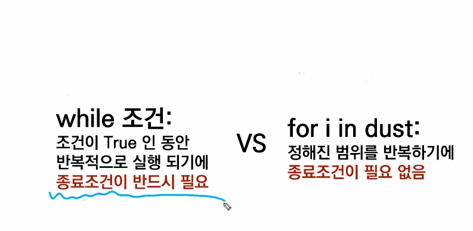
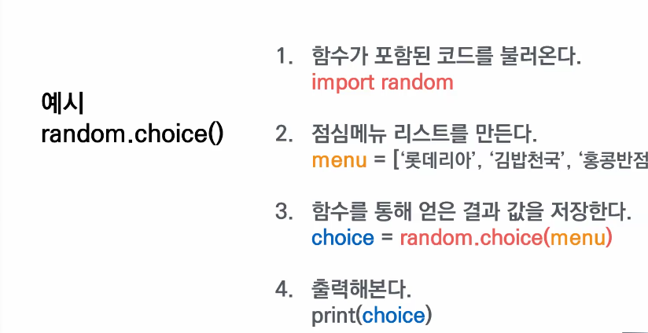
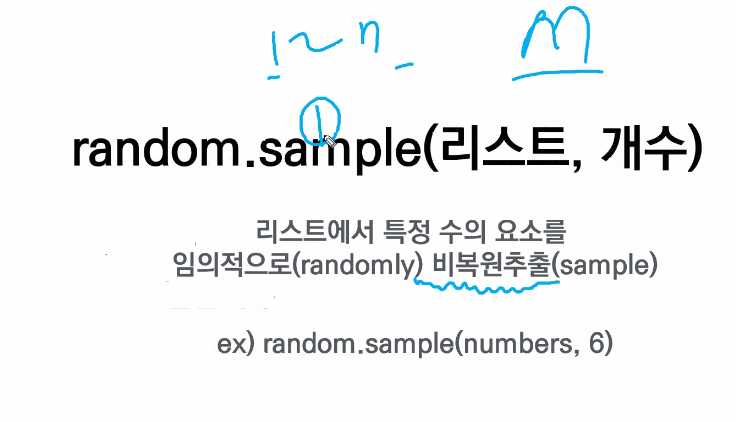

## 반복

## while

- while에 해당하는 조건일 동안 계속 반복.

  n = 0

  while n < 3:

  ​	print('출력')

  ​	n = n+1

​	출력

​	출력

​	출력

## for

- for i in list:

  - print('정해진 범위 안에서 계속')

- dut = [59, 24, 102]

- for i in dust:

  - print(i)

    

# 모듈 활용

1. 함수가 포함된 코드를 불러온다. import

## import random

1) random.choice()
2) random.sample()

## random.choice(리스트)

